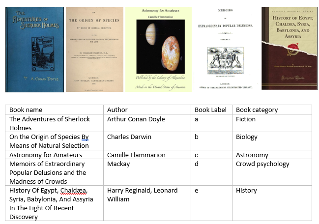
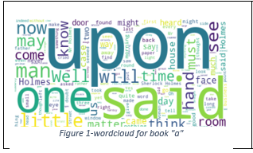

# Text Clustering.

## Descriptin
Testing different feature transformation and text clustering techniques and evaluating their results.

- We selected a group of five books from Gutenberg library,each book had a different author but all of them fall under detective and mystery stories category, the labels are used to identify the books partitions throughout the analysis and modeling.

   

- Then, we visualized the books

- Then,we applyied data exploration and visualization using N-grams plots ,Uni-grams, Bi-grams and word cloud Visualizations.

  

- Appjying Preprocessing and Data Cleansing.
- Data exploration and visualization.
- Using LDA to view topics
- Using feature Extraction and Transformation such as,BOW ,TF/IDF, LDA , Word embedding 

  And Feature selection
- Text Clustering  Models such as,

    1-	WCSS Score and Elbow method

    2-  Silhouette Score

    3-	K-Means 

    

# Conclusion

The objective of the assignment was to explore different text clustering models using different feature transformations techniques and different number of clusters. Then check if the resulting clusters truly represented each topic in the books independently without overlapping with topics from other books.
Five books of different authors and different categories were selected to create the text partitions that was used throughout the assignment. Different combinations of feature extraction techniques and clustering models with different values of k were used. The selected champion model was Hierarchical Agglomerative clustering model using TF-IDF features transformation -min_df equals to 50- with k value equal to 6. The error analysis of the champion model showed that the model was adding partitions of specific book to another books cluster because the terms that appeared in these partitions had a higher IDF weight in the other book.

